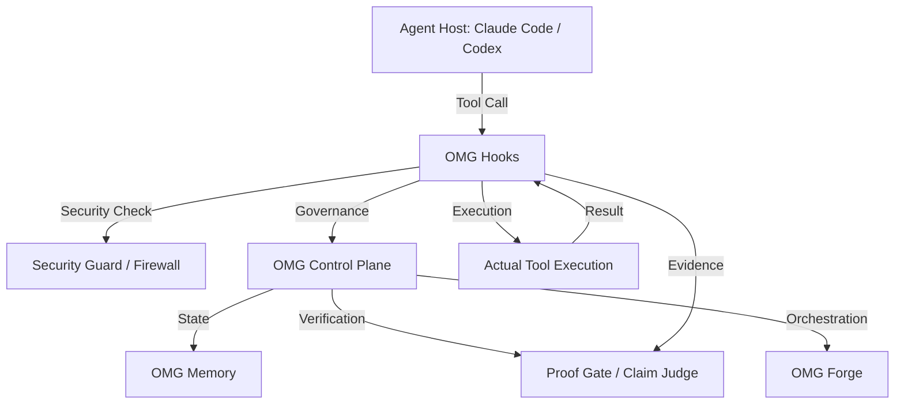
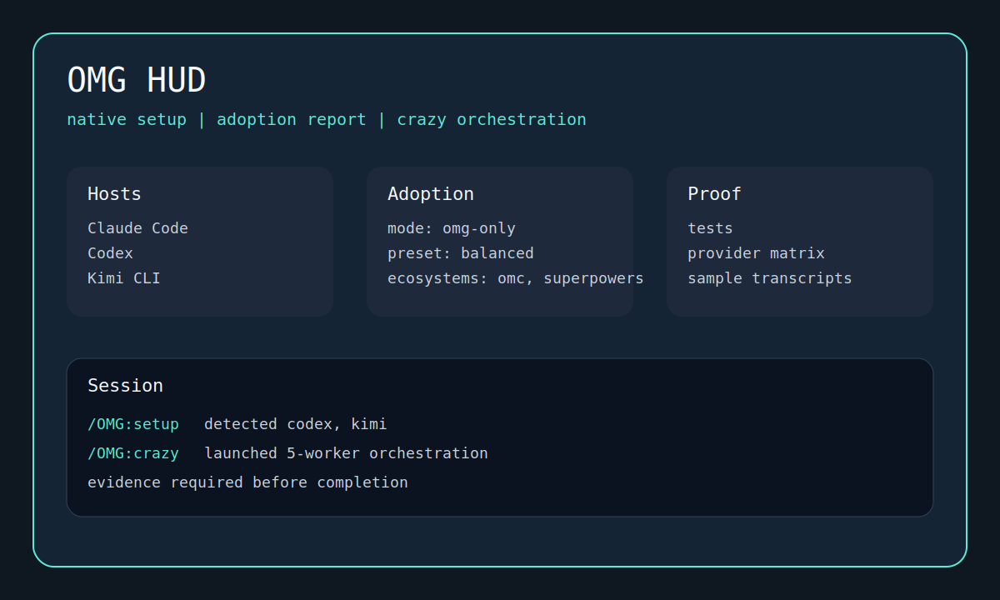

# OMG (Oh My God)

[](https://github.com/trac3r00/OMG/actions/workflows/omg-compat-gate.yml)
[](https://www.npmjs.com/package/@trac3r/oh-my-god)
[](LICENSE)

**Build anything with one command. Governed by default.**
**(딸깍 한 번으로 무엇이든 만드세요. 거버넌스는 기본입니다.)**

🚀 **[Getting Started Guide](docs/GETTING-STARTED.md)** — Get up and running in 1 minute.

---

## ⚡ Instant Mode: One Command, One Product

OMG transforms your prompt into a production-ready codebase in seconds. No more manual setup, boilerplate, or configuration hell.

```bash
# Generate a landing page instantly
npx omg instant "랜딩페이지 만들어줘"

# Generate a SaaS boilerplate
npx omg instant "SaaS 서비스 뼈대 잡아줘"
```

### 📦 What you can build (7 Domain Packs)
- **SaaS**: Full-stack subscription apps
- **Landing**: High-conversion marketing pages
- **E-commerce**: Storefronts with cart and checkout
- **API**: Robust backend services (REST/GraphQL)
- **Bot**: Discord, Slack, and Telegram bots
- **Admin**: Internal dashboards and CMS
- **CLI**: Powerful command-line tools

---

## 🚀 Killer Features

### 🛡️ MutationGate (Under the Hood)
**Stop risky mutations before they happen.**
MutationGate provides a hard gate for file system changes. It intercepts, warns, and blocks unauthorized or risky mutations, especially during release orchestration. No more accidental deletions or unauthorized config changes.
(릴리즈 오케스트레이션 시 변조를 차단하거나 허용하는 강력한 게이트웨이입니다. 위험한 파일 시스템 변경을 사전에 방지합니다.)

### ⚖️ ProofGate (Under the Hood)
**Evidence-backed verification, claim judge.**
ProofGate requires machine-generated evidence (test results, build logs, etc.) for every claim an agent makes. It acts as a judge to verify that a task was actually completed correctly, not just "claimed" to be done.
(에이전트의 주장을 증거 기반으로 검증합니다. 테스트 결과, 빌드 로그 등 객체적 증거를 통해 작업 완료 여부를 심판합니다.)

### 📊 Real-time HUD
Monitor your agent's activity, ProofScore (0-100), and system health in real-time.
(에이전트 활동, 증거 점수(0-100), 시스템 상태를 실시간으로 모니터링하세요.)

---

## 👔 5분 안에 팀 CEO가 되는 법 (Team CEO in 5 Minutes)

개발팀 리더가 OMG를 설치하고 설정하는 데 단 5분이면 충분합니다. 첫 번째 자동화 작업을 실행하자마자 팀 생산성이 5배로 뛰는 것을 경험하세요. OMG는 단순한 도구가 아니라, 당신의 에이전트 팀을 지휘하는 강력한 컨트롤 플레인입니다.

1. **Install**: `npx omg init` (1분)
2. **Configure**: `npx omg install --plan` (2분)
3. **Execute**: 첫 번째 자동화 작업 실행 (2분)

**"OMG는 당신의 에이전트들을 단순한 봇에서 신뢰할 수 있는 팀원으로 바꿉니다."**

---

## ⚔️ Comparison: Why OMG?

| Feature          | Native Claude Code | oh-my-claudecode |   gstack    | everything-claude-code |         **OMG v3.0.0**          |
| :--------------- | :----------------: | :--------------: | :---------: | :--------------------: | :-----------------------------: |
| **Instant Product Generation** | ❌ None | ❌ None | ❌ None | ❌ None | ✅ **7 Domain Packs** |
| **Real-time HUD** | ❌ None | ❌ None | ❌ None | ❌ None | ✅ **Agent Activity + ProofScore** |
| **Governance**   |      ❌ None       |    ⚠️ Limited    | ⚠️ Optional |     ⚠️ AgentShield     | ✅ **Hard Gates + Approval UI** |
| **Verification** |     ❌ Manual      |     ⚠️ Basic     |  ⚠️ Basic   |   ✅ Evidence-Backed   | ✅ **ProofGate + Claim Judge**  |
| **Rollback**     |      ❌ None       |     ❌ None      |   ❌ None   |        ⚠️ Basic        |    ✅ **Rollback Manifests**    |
| **Routing**      |     ❌ Single      |    ❌ Single     |  ❌ Single  |       ❌ Single        |   ✅ **Multi-Model Routing**    |
| **Planning**     |     ❌ Linear      |     ⚠️ Basic     |  ⚠️ Basic   |        ⚠️ Basic        |  ✅ **Governed Deep Planning**  |
| **Multi-Agent**  |      ❌ None       |     ❌ None      |  ⚠️ Basic   |        ⚠️ Basic        |   ✅ **Governed Multi-Agent**   |

**OMG v3.0.0 고유 강점:**

- **Instant Product Generation**: 7가지 도메인 팩을 통해 즉시 제품 생성.
- **Real-time HUD**: 에이전트 활동 및 ProofScore 실시간 모니터링.
- **Hard Gates + Approval UI**: 단순 경고를 넘어선 실제 차단 및 대화형 승인 인터페이스.
- **Rollback Manifests**: 모든 작업에 대한 세밀한 실행 취소 및 복구 능력.
- **Multi-Model Routing**: 작업 복잡도에 따른 최적의 모델 자동 선택 및 예산 관리.
- **Governed Deep Planning**: 보안 정책이 내장된 구조화된 계획 수립.

---

## ⚡ 1-Click Installation UX

설치부터 실행까지 1분이면 충분합니다.

```bash
# 1-Click Init
npx omg init

# OR Step-by-Step
npx omg env doctor && npx omg install --apply
```

설치 후 즉시 사용 가능한 기본 설정이 제공됩니다.

---

## The Problem

Agent hosts like Claude Code and Codex are powerful but lack governance, mutation safety, and evidence-backed verification. They often operate in a "trust me" mode where changes happen without a clear audit trail or safety gates. This leads to risky mutations, lack of interoperability between different agent stacks, and difficulty in verifying that a task was actually completed correctly.

## The Solution

OMG (Oh My God) provides a governance and orchestration layer that sits on top of existing agent hosts. It introduces:

- **Hooks**: Pre-tool and post-tool execution gates for security and validation.
- **Governance Payload**: Structured metadata for every action.
- **Mutation Gate**: Prevents or warns about risky file system changes.
- **Session Health**: Monitors the state of the session and requires review for risky states.
- **Forge**: A modular orchestration engine for complex tasks.
- **Memory**: A secure, namespaced, and encrypted state store.
- **Evidence-Backed Verification**: Machine-generated proof for every claim.

## Real-World Example

Imagine an agent trying to delete a critical configuration file. Without OMG, the agent might just do it. With OMG's **Mutation Gate**, the action is intercepted, a warning is generated, and the user is prompted for approval. Or, when an agent claims a feature is "done", OMG's **Claim Judge** and **Proof Gate** require actual test results and build logs as evidence before the claim is accepted.

## Architecture

OMG operates as a middleware layer between the agent host and the underlying tools.



## Limitations

- **Not a Base Model**: OMG does not train or provide its own LLMs; it orchestrates existing ones.
- **Local-Only**: Designed for same-machine production; no cloud-sync for state by design.
- **Advisory-First**: In v1, many gates are advisory (warnings) rather than hard-blocking to avoid breaking workflows.
- **Host Dependent**: Capabilities are limited by what the underlying agent host supports.

- Brand: `OMG`
- Repo: `https://github.com/trac3r00/OMG`
- npm: `@trac3r/oh-my-god`
- Plugin id: `omg`
- Marketplace id: `omg`

## Why OMG

<!-- OMG:GENERATED:why-omg -->

OMG keeps the host you already use, then adds governed install, proof, and release surfaces on top.

- Canonical host parity targets are Claude, Codex, Gemini, and Kimi.
- OpenCode remains a supported compatibility host for teams that need it.
- Install and verification stay explicit: doctor first, preview second, apply last.

> Legacy Claude compatibility commands such as `/OMG:setup` and `/OMG:crazy <goal>` remain documented as footnotes only.

<!-- /OMG:GENERATED:why-omg -->

- Claude front door: run `npx omg env doctor`, then `npx omg install --plan`, then `npx omg install --apply`.
- Browser front door: run `/OMG:browser <goal>` for browser automation and verification, with `/OMG:playwright` kept as a compatibility alias and the upstream Playwright CLI handling browser execution.
- Multi-host support: Claude Code, Codex, Gemini CLI, and Kimi CLI are canonical behavior-parity hosts; OpenCode is compatibility-only.
- Compiled planning: advanced planning is now compiled into the `plan-council` bundle for deterministic execution.
- Native adoption: setup detects OMC, OMX, and Superpowers-style environments without exposing copycat public migration commands.
- Proof-first delivery: verification, provider coverage, HUD artifacts, and transcripts are published instead of implied.

## Canonical Contract

OMG now ships a production control-plane contract and generated host artifacts. Same-machine production support is anchored by the stdio-first `omg-control` MCP. HTTP control-plane exposure is intended for development and local HUD use only.

- Normative spec: `OMG_COMPAT_CONTRACT.md`
- Executable registry: `registry/omg-capability.schema.json` and `registry/bundles/*.yaml`
- Generated Codex pack: `.agents/skills/omg/`
- Validation: `npx omg contract validate`
- Compilation: `npx omg contract compile --host claude --host codex --host gemini --host kimi --channel public`
- Release gate: `npx omg release readiness --channel dual`



## Quickstart

<!-- OMG:GENERATED:install-intro -->

> **Prerequisites**: macOS or Linux, Node >=18, Python >=3.10

```bash
# interactive first-time setup (doctor → plan → confirm → apply)
npx omg init

# CI/automation path (non-interactive)
npx omg install --apply
npx omg ship
```

Local package-manager installs only link `omg` into `node_modules/.bin/`; they do not mutate configuration.

For CI/automation, use `npx omg install --apply` directly.

<!-- /OMG:GENERATED:install-intro -->

On non-Claude hosts, verify native MCP registration after `npx omg install --apply`:

- `codex mcp list`
- `gemini mcp list`
- `kimi mcp list`

Success looks like:

- supported hosts are detected
- Claude Code sees `omg@omg` as enabled instead of `failed to load`
- Claude Code's plugin bundle owns `omg-control` via `.claude-plugin/mcp.json`; project or user `.mcp.json` entries can keep `filesystem` without collisions
- `~/.claude/settings.json` has a `statusLine` command for `~/.claude/hud/omg-hud.mjs`
- `~/.codex/config.toml`, `~/.gemini/settings.json`, and `~/.kimi/mcp.json` receive `omg-control` after `npx omg install --apply` when those CLIs are on `PATH`
- additional MCP servers are added when a broader preset is selected (`standard` adds `context7`; `full` adds `websearch` and `omg-memory`; `experimental` adds browser automation)
- `.omg/state/adoption-report.json` is written when another ecosystem is present
- OMG reports the selected preset and next step
- narrowed defaults keep the required control plane small while optional capabilities such as browser automation remain opt-in

> Restricted environments / air-gapped fallback only: clone-and-setup flows plus Claude slash commands such as `/OMG:setup` and `/OMG:crazy <goal>` remain available when launcher-first install cannot modify the host directly.

## Install Guides

- Claude Code: [docs/install/claude-code.md](docs/install/claude-code.md)
- Codex: [docs/install/codex.md](docs/install/codex.md)
- OpenCode: [docs/install/opencode.md](docs/install/opencode.md)
- Gemini: [docs/install/gemini.md](docs/install/gemini.md)
- Kimi: [docs/install/kimi.md](docs/install/kimi.md)

## Claude Marketplace Install

Install OMG via Claude Code's plugin marketplace:

```bash
# Add OMG marketplace
/plugin marketplace add https://github.com/trac3r00/OMG

# Install OMG core
/plugin install omg@omg

# Or use claude mcp add for direct MCP installation
claude mcp add omg npx @trac3r/oh-my-god
```

After installation, OMG's governance, orchestration, and skill system are available:

- **Universal skills**: `@governance`, `@orchestrate`, `@memory`, `@proof`, `@forge`
- **Provider skills**: Claude (`@claude/*`), Codex (`@codex/*`), OpenCode (`@opencode/*`), Gemini (`@gemini/*`)
- **Registry**: `registry/skills.json` lists all available skills

## Native Adoption

OMG uses native setup language instead of public migration commands.

- `OMG-only`: recommended. OMG becomes the primary hooks, HUD, MCP, and orchestration layer.
- `coexist`: advanced. OMG preserves non-conflicting third-party surfaces and records overlap instead of overwriting it.
- Modes: `chill`, `focused`, `exploratory`. `focused` is the production default.
- Presets: `minimal`, `standard`, `full`, `experimental`, `production` (`safe`, `balanced`, `interop`, `labs`, and `buffet` still work with deprecation warnings).

## Security Notes

- The shipped `minimal` preset now registers pre-tool security hooks before the planning helper.
- `Bash` requests are screened by `firewall.py`, and file reads or edits are screened by `secret-guard.py`.
- Raw environment dumps, interpreters, and permission-changing commands such as `env`, `node`, `python`, `python3`, `chmod`, and `chown` now require approval instead of being silently allowed.

Compatibility references to OMC, OMX, and Superpowers are documented here: [docs/migration/native-adoption.md](docs/migration/native-adoption.md)

## Proof

Current local verification for this release: See `.omg/evidence/` for machine-generated verification artifacts.

- Truth bundles: `claim-judge`, `test-intent-lock`, `proof-gate`
- Execution Kernel: `exec-kernel` facade with `worker-watchdog` stall detection and `merge-writer` provenance
- Governed Tool Fabric: Lane-based tool governance with signed approval and ledgering
- Budget Envelopes: Multi-dimensional resource tracking (CPU, memory, wall time, tokens, network)
- Host Parity: Semantic host parity normalization across canonical providers
- Issue Surface: Active red-team and diagnostic surface via `/OMG:issue`
- Certification Lane 1 and permanent flagship gate: Music OMR daily verification for deterministic OMR and live transposition under the hardest real-time domain constraints in the stack
- Evidence profiles: `browser-flow`, `forge-cybersecurity`, `interop-diagnosis`, `install-validation`, `buffet`
- Verification and provider matrix: [docs/proof.md](docs/proof.md)
- Sample setup transcript: [docs/transcripts/setup.md](docs/transcripts/setup.md)
- Sample crazy transcript: [docs/transcripts/crazy.md](docs/transcripts/crazy.md)
- Release process: [docs/release-checklist.md](docs/release-checklist.md)

## Command Surface

Primary launcher entry points:

- `npx omg env doctor`
- `npx omg install --plan`
- `npx omg install --apply`
- `npx omg ship`
- `npx omg proof open --html`
- `npx omg blocked --last`

> **Legacy/advanced aliases**: `/OMG:setup`, `/OMG:browser`, `/OMG:crazy`, `/OMG:deep-plan`
> (compatibility path to `plan-council`),
> `/OMG:playwright`, `/OMG:security-check`, `/OMG:api-twin`, `/OMG:preflight`, `/OMG:teams`,
> `/OMG:ccg`, `/OMG:compat`, `/OMG:ship`

## Contributing

Public contributions are welcome.

- Contribution guide: [CONTRIBUTING.md](CONTRIBUTING.md)
- Security reporting: [SECURITY.md](SECURITY.md)
- Changelog: [CHANGELOG.md](CHANGELOG.md)

## Positioning

OMG is a plugin and orchestration layer for supported CLIs. It is not a base-model training project. The goal is to make frontier agent hosts tighter, safer, more interoperable, and more verifiable than the default experience.
