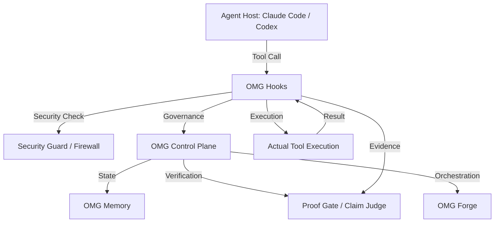

# OMG

[](https://github.com/trac3er00/OMG/actions/workflows/omg-compat-gate.yml)
[](https://www.npmjs.com/package/@trac3er/oh-my-god)
[](LICENSE)

OMG upgrades your agent host instead of replacing it. It gives Claude Code, Codex, and other supported CLIs a tighter setup flow, stronger orchestration, native adoption from older plugin stacks, and proof-backed verification.

## The Problem

Agent hosts like Claude Code and Codex are powerful but lack governance, mutation safety, and evidence-backed verification. They often operate in a "trust me" mode where changes happen without a clear audit trail or safety gates. This leads to risky mutations, lack of interoperability between different agent stacks, and difficulty in verifying that a task was actually completed correctly.

## The Solution

OMG (Oh My God) provides a governance and orchestration layer that sits on top of existing agent hosts. It introduces:

- **Hooks**: Pre-tool and post-tool execution gates for security and validation.
- **Governance Payload**: Structured metadata for every action.
- **Mutation Gate**: Prevents or warns about risky file system changes.
- **Session Health**: Monitors the state of the session and requires review for risky states.
- **Forge**: A modular orchestration engine for complex tasks.
- **Memory**: A secure, namespaced, and encrypted state store.
- **Evidence-Backed Verification**: Machine-generated proof for every claim.

## Real-World Example

Imagine an agent trying to delete a critical configuration file. Without OMG, the agent might just do it. With OMG's **Mutation Gate**, the action is intercepted, a warning is generated, and the user is prompted for approval. Or, when an agent claims a feature is "done", OMG's **Claim Judge** and **Proof Gate** require actual test results and build logs as evidence before the claim is accepted.

## Architecture

OMG operates as a middleware layer between the agent host and the underlying tools.



## Comparison

| Feature | Raw Claude Code | Superpowers | OMG |
| :--- | :---: | :---: | :---: |
| **Governance** | Minimal | Plugin-based | Native Control Plane |
| **Mutation Safety** | Basic | None | Hard Gates + Warnings |
| **Verification** | Manual | None | Evidence-Backed Proof |
| **Interoperability** | Single Host | Multi-Host | Universal MCP + Registry |
| **State Management** | Volatile | Local Files | Encrypted + Namespaced |
| **Orchestration** | Linear | Scripted | Modular Forge |

## Limitations

- **Not a Base Model**: OMG does not train or provide its own LLMs; it orchestrates existing ones.
- **Local-Only**: Designed for same-machine production; no cloud-sync for state by design.
- **Advisory-First**: In v1, many gates are advisory (warnings) rather than hard-blocking to avoid breaking workflows.
- **Host Dependent**: Capabilities are limited by what the underlying agent host supports.

- Brand: `OMG`
- Repo: `https://github.com/trac3er00/OMG`
- npm: `@trac3er/oh-my-god`
- Plugin id: `omg`
- Marketplace id: `omg`

## Why OMG

<!-- OMG:GENERATED:why-omg -->
OMG keeps the host you already use, then adds governed install, proof, and release surfaces on top.

- Canonical host parity targets are Claude, Codex, Gemini, and Kimi.
- OpenCode remains a supported compatibility host for teams that need it.
- Install and verification stay explicit: doctor first, preview second, apply last.

> Legacy Claude compatibility commands such as `/OMG:setup` and `/OMG:crazy <goal>` remain documented as footnotes only.
<!-- /OMG:GENERATED:why-omg -->

- Claude front door: run `npx omg env doctor`, then `npx omg install --plan`, then `npx omg install --apply`.
- Browser front door: run `/OMG:browser <goal>` for browser automation and verification, with `/OMG:playwright` kept as a compatibility alias and the upstream Playwright CLI handling browser execution.
- Multi-host support: Claude Code, Codex, Gemini CLI, and Kimi CLI are canonical behavior-parity hosts; OpenCode is compatibility-only.
- Compiled planning: advanced planning is now compiled into the `plan-council` bundle for deterministic execution.
- Native adoption: setup detects OMC, OMX, and Superpowers-style environments without exposing copycat public migration commands.
- Proof-first delivery: verification, provider coverage, HUD artifacts, and transcripts are published instead of implied.

## Canonical Contract

OMG now ships a production control-plane contract and generated host artifacts. Same-machine production support is anchored by the stdio-first `omg-control` MCP. HTTP control-plane exposure is intended for development and local HUD use only.

- Normative spec: `OMG_COMPAT_CONTRACT.md`
- Executable registry: `registry/omg-capability.schema.json` and `registry/bundles/*.yaml`
- Generated Codex pack: `.agents/skills/omg/`
- Validation: `npx omg contract validate`
- Compilation: `npx omg contract compile --host claude --host codex --host gemini --host kimi --channel public`
- Release gate: `npx omg release readiness --channel dual`


## Quickstart

<!-- OMG:GENERATED:install-intro -->
> **Prerequisites**: macOS or Linux, Node >=18, Python >=3.10

```bash
npx omg env doctor
npx omg install --plan
# confirm preview output before applying
npx omg install --apply
npx omg ship
```

Local package-manager installs only link `omg` into `node_modules/.bin/`; they do not mutate configuration.

The package postinstall runs `npx omg install --plan` as a preview, so it makes no mutations until you explicitly run `npx omg install --apply`.
<!-- /OMG:GENERATED:install-intro -->

On non-Claude hosts, verify native MCP registration after `npx omg install --apply`:

- `codex mcp list`
- `gemini mcp list`
- `kimi mcp list`

Success looks like:

- supported hosts are detected
- Claude Code sees `omg@omg` as enabled instead of `failed to load`
- Claude Code's plugin bundle owns `omg-control` via `.claude-plugin/mcp.json`; project or user `.mcp.json` entries can keep `filesystem` without collisions
- `~/.claude/settings.json` has a `statusLine` command for `~/.claude/hud/omg-hud.mjs`
- `~/.codex/config.toml`, `~/.gemini/settings.json`, and `~/.kimi/mcp.json` receive `omg-control` after `npx omg install --apply` when those CLIs are on `PATH`
- additional MCP servers are added when a broader preset is selected (`balanced` adds `context7`; `interop` adds `websearch` and `omg-memory`; `labs` adds browser automation)
- `.omg/state/adoption-report.json` is written when another ecosystem is present
- OMG reports the selected preset and next step
- narrowed defaults keep the required control plane small while optional capabilities such as browser automation remain opt-in

> Legacy compatibility only: clone-and-setup flows plus Claude slash commands such as `/OMG:setup` and `/OMG:crazy <goal>` remain available for older environments, but they are not the primary install path.

## Install Guides

- Claude Code: [docs/install/claude-code.md](docs/install/claude-code.md)
- Codex: [docs/install/codex.md](docs/install/codex.md)
- OpenCode: [docs/install/opencode.md](docs/install/opencode.md)
- Gemini: [docs/install/gemini.md](docs/install/gemini.md)
- Kimi: [docs/install/kimi.md](docs/install/kimi.md)
## Native Adoption

OMG uses native setup language instead of public migration commands.

- `OMG-only`: recommended. OMG becomes the primary hooks, HUD, MCP, and orchestration layer.
- `coexist`: advanced. OMG preserves non-conflicting third-party surfaces and records overlap instead of overwriting it.
- Modes: `chill`, `focused`, `exploratory`. `focused` is the production default.
- Presets: `safe`, `balanced`, `interop`, `labs`, `production` (all governed flags on).

## Security Notes

- The shipped `safe` preset now registers pre-tool security hooks before the planning helper.
- `Bash` requests are screened by `firewall.py`, and file reads or edits are screened by `secret-guard.py`.
- Raw environment dumps, interpreters, and permission-changing commands such as `env`, `node`, `python`, `python3`, `chmod`, and `chown` now require approval instead of being silently allowed.

Compatibility references to OMC, OMX, and Superpowers are documented here: [docs/migration/native-adoption.md](docs/migration/native-adoption.md)

## Proof

Current local verification for this release: See `.omg/evidence/` for machine-generated verification artifacts.

- Truth bundles: `claim-judge`, `test-intent-lock`, `proof-gate`
- Execution Kernel: `exec-kernel` facade with `worker-watchdog` stall detection and `merge-writer` provenance
- Governed Tool Fabric: Lane-based tool governance with signed approval and ledgering
- Budget Envelopes: Multi-dimensional resource tracking (CPU, memory, wall time, tokens, network)
- Host Parity: Semantic host parity normalization across canonical providers
- Issue Surface: Active red-team and diagnostic surface via `/OMG:issue`
- Certification Lane 1: Music OMR daily gate for deterministic OMR and live transposition
- Evidence profiles: `browser-flow`, `forge-cybersecurity`, `interop-diagnosis`, `install-validation`, `buffet`
- Verification and provider matrix: [docs/proof.md](docs/proof.md)
- Sample setup transcript: [docs/transcripts/setup.md](docs/transcripts/setup.md)
- Sample crazy transcript: [docs/transcripts/crazy.md](docs/transcripts/crazy.md)
- Release process: [docs/release-checklist.md](docs/release-checklist.md)

## Command Surface

Primary launcher entry points:

- `npx omg env doctor`
- `npx omg install --plan`
- `npx omg install --apply`
- `npx omg ship`
- `npx omg proof open --html`
- `npx omg blocked --last`

> **Legacy/advanced aliases**: `/OMG:setup`, `/OMG:browser`, `/OMG:crazy`, `/OMG:deep-plan`,
> `/OMG:playwright`, `/OMG:security-check`, `/OMG:api-twin`, `/OMG:preflight`, `/OMG:teams`,
> `/OMG:ccg`, `/OMG:compat`, `/OMG:ship`

## Contributing

Public contributions are welcome.

- Contribution guide: [CONTRIBUTING.md](CONTRIBUTING.md)
- Security reporting: [SECURITY.md](SECURITY.md)
- Changelog: [CHANGELOG.md](CHANGELOG.md)

## Positioning

OMG is a plugin and orchestration layer for supported CLIs. It is not a base-model training project. The goal is to make frontier agent hosts tighter, safer, more interoperable, and more verifiable than the default experience.
