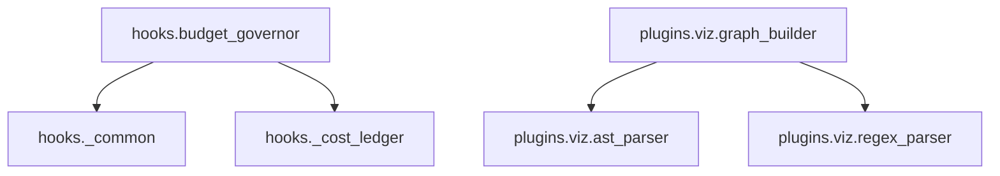

# /OMG:arch — Architecture Visualization

Visualize project dependency graphs as Mermaid diagrams, render to PNG, zoom into specific modules, and inspect graph statistics.

## Usage

```
/OMG:arch
/OMG:arch render
/OMG:arch <module-name>
/OMG:arch stats
/OMG:arch --native
```

## Sub-Commands

### `/OMG:arch` (default)

Full project dependency graph as Mermaid text output, embeddable in Markdown.

Scans all Python (.py), JavaScript/TypeScript (.js/.jsx/.ts/.tsx), and Go (.go) files. Python files are parsed via AST; JS/TS/Go files use regex-based import detection (~70% accuracy).

```python
from plugins.viz.graph_builder import build_project_graph
from plugins.viz.diagram_generator import generate_mermaid

result = build_project_graph(".")
graph = result.get("graph", {})

mermaid_text = generate_mermaid(graph)
if mermaid_text:
    print("```mermaid")
    print(mermaid_text)
    print("```")
else:
    print("No dependencies detected.")
```

### `/OMG:arch render`

Render the dependency graph to a PNG image via the mermaid.ink public API. Saves output to `.omg/state/arch-diagram.png`.

Requires network access to `https://mermaid.ink`.

```python
import os
from plugins.viz.graph_builder import build_project_graph
from plugins.viz.diagram_generator import generate_mermaid, render_to_png

result = build_project_graph(".")
graph = result.get("graph", {})
mermaid_text = generate_mermaid(graph)

output_path = os.path.join(".omg", "state", "arch-diagram.png")
os.makedirs(os.path.dirname(output_path), exist_ok=True)

if render_to_png(mermaid_text, output_path):
    print(f"Diagram rendered to {output_path}")
else:
    print("Render failed — check network access or graph size.")
```

### `/OMG:arch <module-name>`

Zoomed subgraph for a specific module. Shows only the named module and its direct dependencies.

Replace `<module-name>` with the dotted module path (e.g. `plugins.viz.graph_builder`).

```python
from plugins.viz.graph_builder import build_project_graph
from plugins.viz.diagram_generator import generate_mermaid

result = build_project_graph(".")
graph = result.get("graph", {})

# Zoom into a specific module
module_name = "<module-name>"  # e.g. "plugins.viz.graph_builder"
mermaid_text = generate_mermaid(graph, zoom=module_name)

if mermaid_text:
    print(f"Dependencies for: {module_name}")
    print()
    print("```mermaid")
    print(mermaid_text)
    print("```")
else:
    print(f"Module '{module_name}' not found in dependency graph.")
    print()
    print("Available modules:")
    for mod in sorted(graph.keys()):
        print(f"  - {mod}")
```

### `/OMG:arch stats`

Graph statistics: module count, edge count, max depth, circular dependencies, and coupling score.

```python
from plugins.viz.graph_builder import build_project_graph

result = build_project_graph(".")
metrics = result.get("metrics", {})

module_count = metrics.get("module_count", 0)
edge_count = metrics.get("edge_count", 0)
max_depth = metrics.get("max_depth", 0)
circular_deps = metrics.get("circular_deps", [])
coupling_score = metrics.get("coupling_score", 0.0)

print(f"Modules:        {module_count}")
print(f"Edges:          {edge_count}")
print(f"Max depth:      {max_depth}")
print(f"Circular deps:  {len(circular_deps)}")
print(f"Coupling score: {coupling_score:.2f}")

if circular_deps:
    print()
    print("Circular dependency cycles:")
    for cycle in circular_deps:
        print(f"  {' → '.join(cycle)}")
```

### `/OMG:arch --native`

Use native language toolchains for higher-accuracy dependency parsing (~95% vs ~70% with regex).

Supported toolchains:
- **Go**: `go list -json ./...` — requires `go` on PATH
- **TypeScript**: `tsc --listFiles --noEmit` — requires `tsc` on PATH
- **Rust**: `cargo metadata --format-version=1 --no-deps` — requires `cargo` on PATH

Falls back to regex parsing when a toolchain is not available.

```python
from plugins.viz.native_parsers import (
    is_toolchain_available,
    parse_go_native,
    parse_typescript_native,
    parse_rust_native,
)
from plugins.viz.graph_builder import build_project_graph
from plugins.viz.diagram_generator import generate_mermaid

# Check available toolchains
toolchains = {
    "go": is_toolchain_available("go"),
    "tsc": is_toolchain_available("tsc"),
    "cargo": is_toolchain_available("cargo"),
}

print("Toolchain availability:")
for tc, available in toolchains.items():
    status = "available" if available else "not found"
    print(f"  {tc}: {status}")
print()

# Parse with native toolchains where available
native_graphs = {}
if toolchains["go"]:
    go_result = parse_go_native(".")
    if "error" not in go_result:
        native_graphs.update(go_result["graph"])
        print(f"Go: {len(go_result['graph'])} packages (native-95% accuracy)")

if toolchains["tsc"]:
    ts_result = parse_typescript_native(".")
    if "error" not in ts_result:
        native_graphs.update(ts_result["graph"])
        print(f"TypeScript: {len(ts_result['graph'])} modules (native-95% accuracy)")

if toolchains["cargo"]:
    rust_result = parse_rust_native(".")
    if "error" not in rust_result:
        native_graphs.update(rust_result["graph"])
        print(f"Rust: {len(rust_result['graph'])} crates (native-95% accuracy)")

# Fall back to regex-based graph for remaining files
result = build_project_graph(".")
graph = result.get("graph", {})

# Merge: native results override regex results
merged = {**graph, **native_graphs}

mermaid_text = generate_mermaid(merged)
if mermaid_text:
    print()
    print("```mermaid")
    print(mermaid_text)
    print("```")
```

## Feature Flag

- **Flag name**: `OMG_CODEBASE_VIZ_ENABLED`
- **Default**: `False` (disabled)
- **Enable**: `export OMG_CODEBASE_VIZ_ENABLED=1`

Or set in `settings.json`:

```json
{
  "_omg": {
    "features": {
      "CODEBASE_VIZ": true
    }
  }
}
```

## Output Example

### `/OMG:arch` output

````

````

### `/OMG:arch stats` output

```
============================================================
  OMG Architecture — Graph Statistics
============================================================

  Modules:        42
  Edges:          87
  Max depth:      6
  Circular deps:  1
  Coupling score: 2.07

  Circular dependency cycles:
    hooks._common → hooks.query → hooks._common

============================================================
```

### `/OMG:arch --native` accuracy comparison

| Method | Accuracy | Requires |
|--------|----------|----------|
| Regex (default) | ~70% | No external tools |
| Native toolchain | ~95% | `go`, `tsc`, or `cargo` on PATH |

## Supported Languages

| Language | Extensions | Default Parser | Native Parser |
|----------|-----------|----------------|---------------|
| Python | `.py` | AST (`ast` stdlib) | — |
| JavaScript/TypeScript | `.js`, `.jsx`, `.ts`, `.tsx`, `.mjs`, `.cjs` | Regex | `tsc --listFiles` |
| Go | `.go` | Regex | `go list -json` |
| Rust | `.rs` (via Cargo) | — | `cargo metadata` |

## Safety

- **Read-only**: All sub-commands only read source files and query external APIs (mermaid.ink for PNG render)
- **Feature-gated**: Requires `CODEBASE_VIZ` flag enabled
- **No mutations**: Never modifies source code, dependencies, or project configuration
- **Crash-isolated**: All operations return empty/false on failure (never raise to caller)
- **Cache**: Graph cached to `.omg/state/dependency-graph.json` with mtime-based incremental updates
- **Network**: `/arch render` requires internet access for mermaid.ink API
- **Subprocess safety**: Native parsers use argv lists (never `shell=True`) with 30s timeout

## API

```python
from plugins.viz.graph_builder import build_project_graph
from plugins.viz.diagram_generator import generate_mermaid, generate_d2, render_to_png
from plugins.viz.native_parsers import (
    parse_go_native,
    parse_typescript_native,
    parse_rust_native,
    is_toolchain_available,
)

# Build full dependency graph (regex + AST)
result = build_project_graph(".")
# result = {"graph": {...}, "metrics": {...}}

# Generate Mermaid diagram text
mermaid_text = generate_mermaid(result["graph"])

# Generate Mermaid for a single module (zoomed)
zoomed = generate_mermaid(result["graph"], zoom="plugins.viz.graph_builder")

# Generate D2 diagram text
d2_text = generate_d2(result["graph"])

# Render Mermaid to PNG via mermaid.ink
success = render_to_png(mermaid_text, ".omg/state/arch-diagram.png")

# Native toolchain parsing (higher accuracy)
go_deps = parse_go_native(".")
ts_deps = parse_typescript_native(".")
rs_deps = parse_rust_native(".")
```
