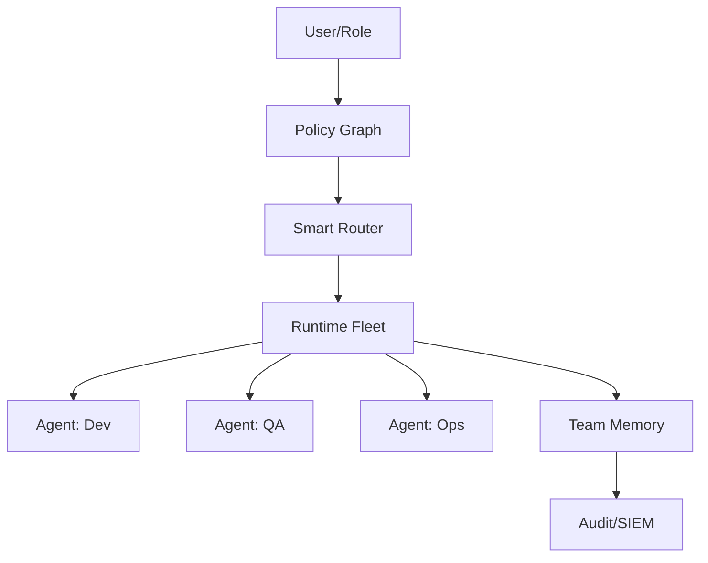

# Phase 3: Organizational AI Work OS Roadmap

> **Status**: Future | **Estimated Start**: After Phase 2 completion

## Overview

Phase 3 transforms OMG from a personal AI work OS into an organizational platform with role-aware UX, team memory, and enterprise governance.

## Architecture

## Features

### 1. Role-aware UX

**Problem**: Same interface for all users regardless of role
**Solution**: Detect user role (dev/PM/exec); adapt prompts, outputs, and permissions
**Effort**: XL (4-6 weeks)
**Dependencies**: User identity system, role definitions

### 2. Team Memory + Policy Graph

**Problem**: Each user starts fresh; no shared organizational knowledge
**Solution**: Shared team memory with policy graph encoding org rules and preferences
**Effort**: XXL (6-8 weeks)
**Dependencies**: Memory Compactor (Phase 2), policy DSL

### 3. Audit/SIEM/Rollback Manifests

**Problem**: No enterprise-grade audit trail for AI actions
**Solution**: Immutable audit log with SIEM export; rollback manifests for every action
**Effort**: L (3-4 weeks)
**Dependencies**: Existing JSONL audit trail

### 4. Runtime Fleet Concept

**Problem**: Single agent per user; no parallel org-wide execution
**Solution**: Fleet of specialized agents (dev, QA, ops, security) coordinated by council
**Effort**: XXL (8-10 weeks)
**Dependencies**: Council Protocol (Phase 2), multi-agent infrastructure

### 5. Subscription Tiering Model

**Problem**: No monetization or usage governance model
**Solution**: Free/Pro/Enterprise tiers with feature gates and usage limits
**Effort**: L (3-4 weeks)
**Dependencies**: Usage tracking, billing integration
